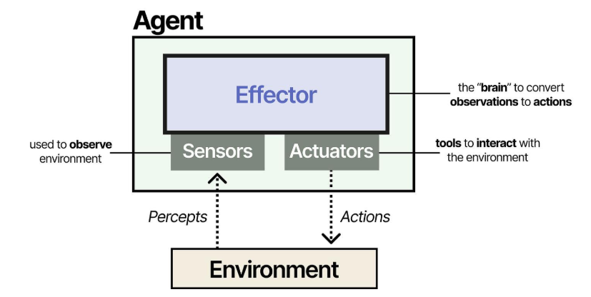
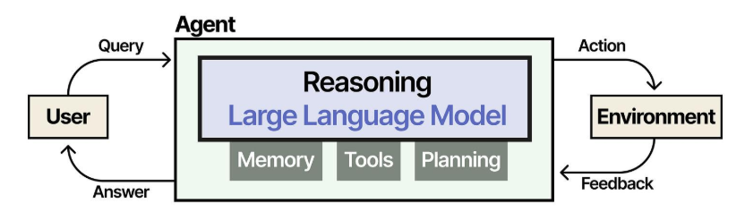
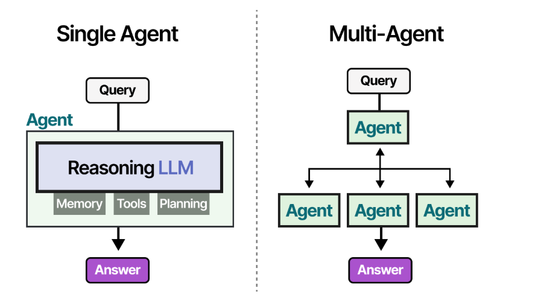
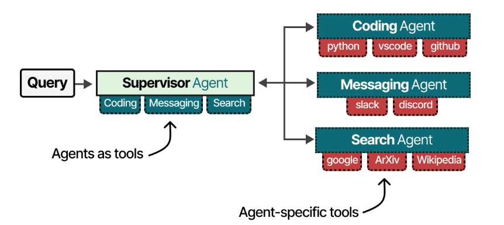

### Agents 101 

An agent is anything that can be viewed as perceiving its environment through sensors and acting upon that environment through actuators. An “agentic system” is a reasoning LLM augmented with memory, tools, and planning, embedded in workflows with a chosen degree of autonomy, from single-step tool calls with guardrails to fully autonomous behavior.

In practice, the “brain” is a reasoning LLM; tools are its actuators, multimodal inputs (text, images, audio, etc.) serve as sensors, and the user plus digital systems form the environment in which the agent operates.

Reasoning LLMs extend this by “thinking out loud”: they first generate intermediate reasoning traces (“thoughts”) and then an answer, enabling better multi-step reasoning, planning, tool choice, and error correction, at the cost of more compute; “regular” LLMs are still preferred for fast, cheap answers.

 

Traditionally, an LLM is a model that does nothing more than predict the next word based on a given input text. The LLM therefore predicts the next token, uses the predicted token to update its input, and then continues the predictions. 
By doing this iteratively (which is called **autoregression**), it can create entire answers to the user’s query. 

### Reasoning Large Language Models

OpenAI and many other LLM providers have focused on scaling GPT-3.5-like models to new heights by throwing more data, compute, and parameters at these models. This is called **train-time scaling**, where training these models on more data and making them larger had a proportional effect on performance. The idea was that pre-training (the first and most expensive part of training an LLM) is the fossil fuel of AI. The larger your pre-training budget, the better the resulting model will be.

### Multi Agent Systems 
 These are systems where multiple different Agents are deployed that are each responsible for different tasks. Compared to single-agent systems, Multi-Agent systems interact with one another and might consult each other’s specialties.

These Multi-Agent systems often contain specialized Agents, each equipped with different toolsets. Although workflows may differ, there is often a supervisor Agent that manages communication between, and sometimes within, Agents. In practice, the supervisor Agent tends to have the most capable LLM, as the supervisor is in charge of advanced behavior like planning, decomposing, and assigning tasks.

