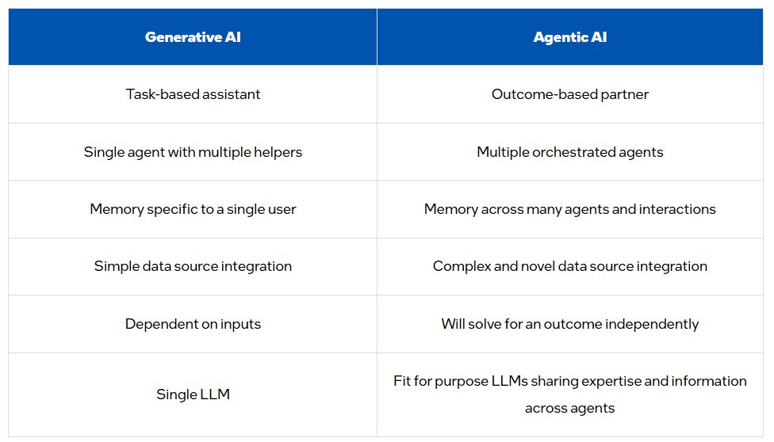

# Generative AI vs. Agentic AI 

GenAI operates reactively. It responds to specific prompts without a deep understanding of context or long-term goals. For example, it can generate an email when asked but does not proactively manage ongoing tasks. 

Agentic AI functions autonomously. It can monitor an inbox, identify urgent messages, draft responses based on past communications, and even schedule meetings. It adapts dynamically to user feedback and changing priorities. 

Large GenAI frontier models typically have a front-end agent that controls multiple smaller helper models. This is called a mixture of experts. The front-end agent is responsible for interaction with the end user. It routes requests to the best underlying expert models and then synthesizes these requests to formulate an answer. These underlying expert models focus on specific intelligence domains such as mathematical calculations or creative writing. They are more independent to use underneath the higher-level interactive agent.  

Agentic AI operates differently. The underlying agents in Agentic AI are less tightly integrated with the higher-level orchestrator and with one another. They work independently, adapt to dynamic environments, and synthesize novel data inputs. They also operate autonomously without constant direction from the orchestrator. The result is they can achieve a more complex objective without continual human direction or prompting. 

GenAI typically has memory specific to a single user. This means it does not have breadth of information across many users and agents. Agentic AI has memory across many users and agents. These agents learn from past interactions, adapt over time, and make more informed decisions. This leads to more context-aware, coherent, and strategic execution of tasks. 

